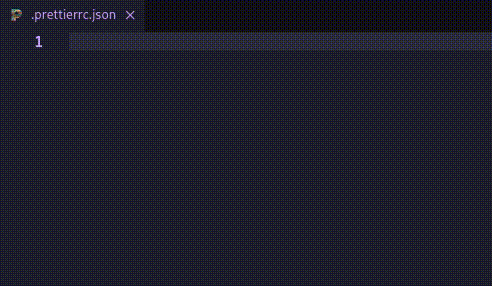
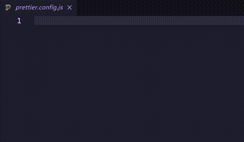
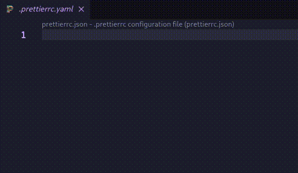
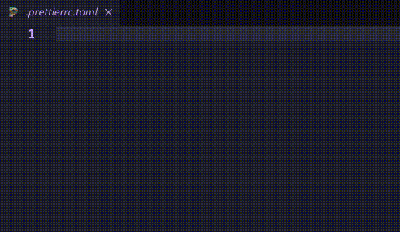

# Prettier Config Boilerplate

A template config for prettier config files using snippets. Available in JSON, JS, YAML and TOML files.

## Usage
Create a prettier config file in your current project and type `ptc`.

**JSON:**

**JavaScript (ES Modules):**

**JavaScript (CommonJS):**

**YAML:**

> You need the `YAML` extension to work correctly.

**TOML:**

> You need the `TOML` extension to work correctly.

Source Code: [https://github.com/martinval11/prettier-config-boilerplate](https://github.com/martinval11/vsc-prettier-config-boilerplate)

If you find any issue, you can report it in [GitHub](https://github.com/martinval11/vsc-prettier-config-boilerplate)